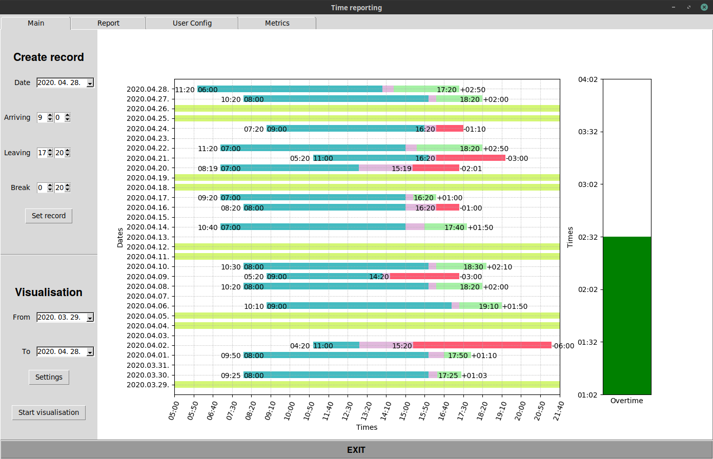
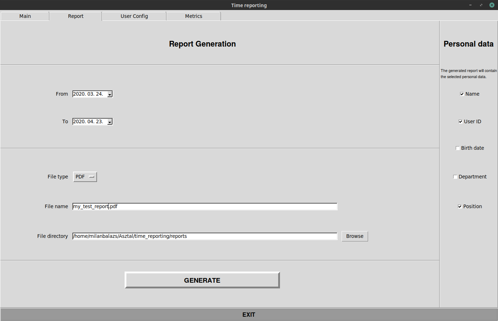

# Working-time reporting tool

## Badges:


## Main window:



## Report window:



## Usage:

````
>>> python3 time_reporting.py
````

## NOTE:
#### The tool is in progress. It has not been released!

## TODO:

Fill the README.md with content!
