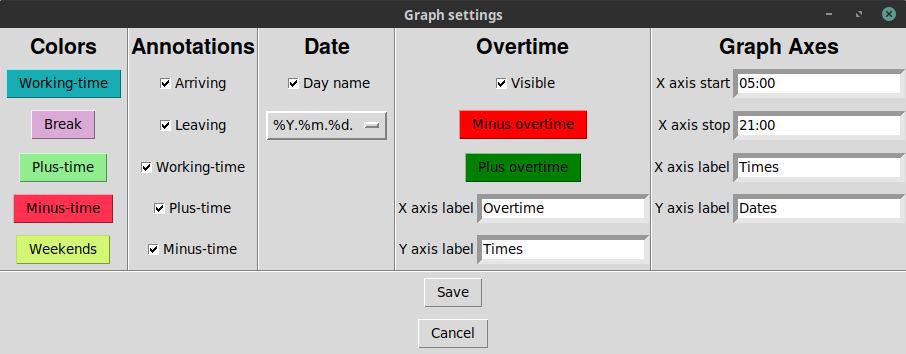
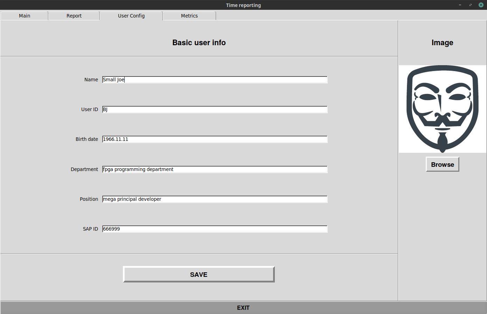
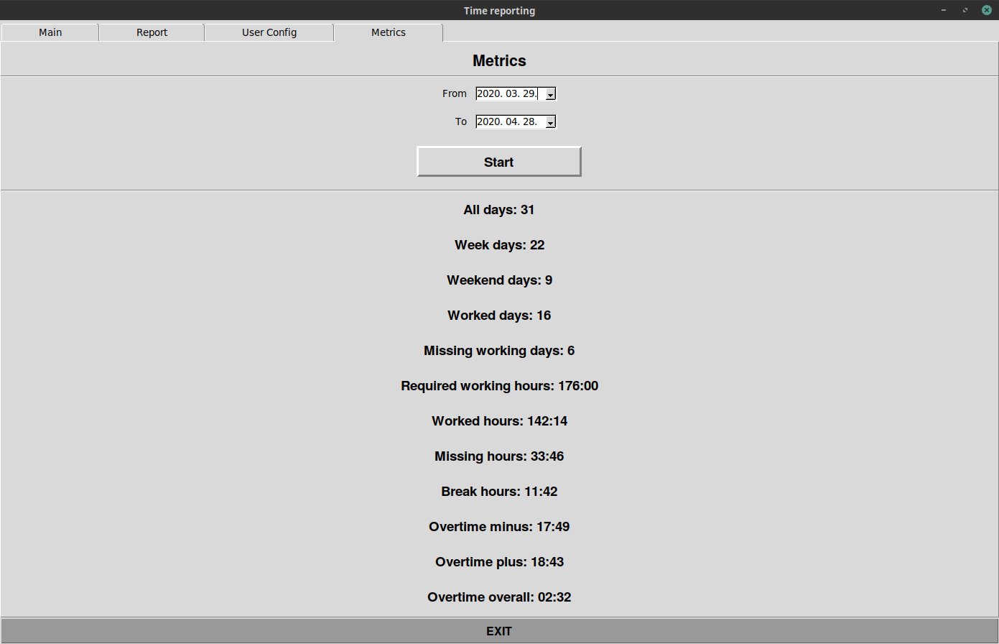

# Working-time reporting tool

## Badges:


## Main tab:


## Graph settings:



## Report tab:


## User config tab:



## Metrics tab:



## Usage:

````
>>> python3 time_reporting.py [--test]
````

## NOTE:
#### The tool is in progress. It has not been released!

## TODO:

Fill the README.md with content!
